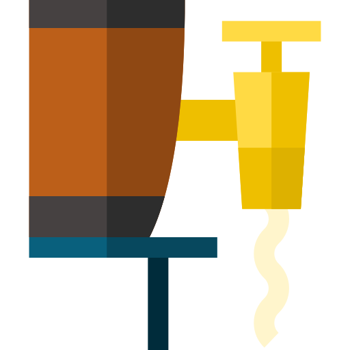

# homebrew-tap

 

A collection of formula definitions for the [Homebrew](https://brew.sh) package manager.

## How do I install these formulae?

`brew install marcransome/tap/<formula>`

Or `brew tap marcransome/tap` and then `brew install <formula>`.

## Available packages

| Name   | Description                                                                    | Homepage                                                                   |
|--------|--------------------------------------------------------------------------------|----------------------------------------------------------------------------|
| `flog` | A command-line tool for sending log messages to Apple's unified logging system | [github.com/marcransome/flog](https://github.com/marcransome/flog) |

## Documentation

`brew help`, `man brew` or check [Homebrew's documentation](https://docs.brew.sh).

## Acknowledgements

* Barrel icon made by [Freepik](https://www.flaticon.com/authors/freepik) from [www.flaticon.com](https://www.flaticon.com/)

## License

`homebrew-tap` is provided under the terms of the [MIT License](https://opensource.org/licenses/mit-license.php).

## Contact

Email me at [marc.ransome@fidgetbox.co.uk](mailto:marc.ransome@fidgetbox.co.uk) or tweet [@marcransome](http://www.twitter.com/marcransome).
